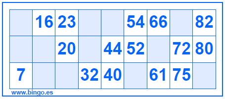
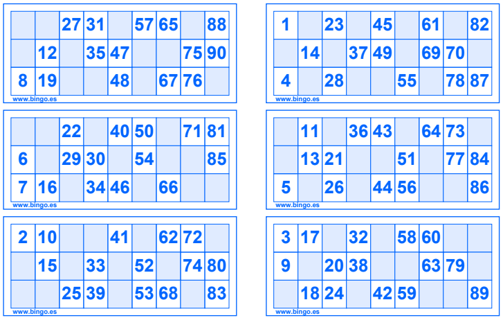
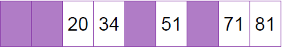
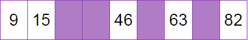
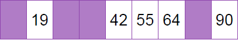
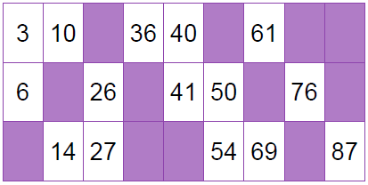
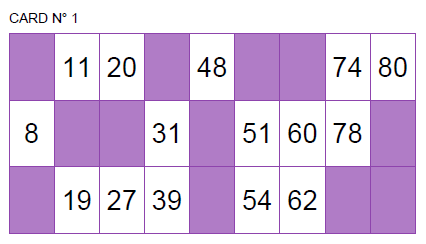

Hello wor... Well, my first hello world post appeared about a year ago,
but this site had the same fate as many of my othe side-projects... abandonment.

Until now.

## Introduction

Today I'm going to show you how I came up with "an algorithm" to generate random
bingo cards and some utility functions to print them on a nice looking (?) .pdf file.

First of all, what type of bingo card I'm referring to? As an Argentine, the only
bingo cards I've ever heard of are bingo cards like this one

<center>



</center>

It contains fifteen numbers from 1 to 90 that are divided in three rows and nine
columns. The first column contains numbers between 1 and 9, the second column numbers
between 10 and 20, and so on until the last column that contains numbers between
80 and 90. The type of bingo that you play with this bingo card is known as the
[90-ball bingo game](https://en.wikipedia.org/wiki/Bingo_(British_version))
or British bingo. As I said, this is the only version I knew before this project
^[How I dare to call this a project?] and I think it is the only bingo version you'll
find here in Argentina (I also bet you'll find some fellow Argentine confirming this
a national invention).

So, if you entered this post thinking you'll find how to print those bingo cards
that are popular in places like United States, I'm sorry, this is not for you
^[But you should try this bingo, you gonna like it!].
Fortunately, other people have invented a tool for you even before I wondered
how to generate bingo cards. If you are interested, have a look at
[this package](https://github.com/jennybc/bingo) and the Shiny app introduced there.

Now, let's go back to our business.

Anyone who has gone to one of those events where people gather to play bingo
^[Some are also known as _sobremesa_] knows that bingo cards don't usually come
separated in individual pieces of paper. Sellers usually have strips of six bingo
cards in their hands. In some events, you can buy bingo cards directly.
In others, you have to buy the entire strip.

Since this is a 90-ball bingo game and each card contains fifteen numbers,
six bingo cards with no repeated numbers is all we need to have all the numbers of
the game in a single strip. You see where it is going?. Yes, we won't generate
isolated cards, we'll generate entire strips. This is how a bingo strip looks like
(just imagine them vertically stacked on a single strip)

<center>



</center>

## Valid cards and valid strips

Bingo cards are not just a bunch of numbers thrown at a piece of paper.
All valid strips are composed of six valid cards each made of three valid rows.
But not any combinations of three valid rows make up a valid card nor any
combinations of six valid cards make up a valid strip. What a shame!

But what is a valid row, a valid card, a va... whatever.
Let's just get to the point and list the rules that will govern how we generate
bingo cards.

### Valid row

We're going to think that a row is a numeric vector of length nine where some
elements are empty and some are filled with numbers.

* Exactly five elements are numbers, and four are empty.
* There can't be more than two consecutive empty elements, which is equivalent to
having at most three consecutive numbers.

**Example valid rows**

<center>




</center>

**Example invalid rows**

<center>




</center>


### Valid card

We can think that a bingo card is a matrix of three rows and nine columns.
Each row must be a valid row as specified in the previous point, plus

* No column can be completely empty.
* No column can be completely filled with numbers.
* Numbers are sorted in ascending order within columns.

**Example valid card**

<center>



</center>

### Valid strip

A valid strip contains six valid cards that satisfy the following conditions

* The first column must have **nine** numbers and nine empty slots.
* Columns 2 to 8 must have **ten** numbers and eight empty slots.
* Column 9 must have **eleven** numbers and seven empty slots.

In total, we have $6\times3\times9 = 162$ slots in a strip.
90 of them are filled with numbers, 72 are not.

## Sample this, sample that, I've got no need to compute them all^[Haven't you heard _Estallando desde el océano_ by Sumo?]

One approach to generate bingo cards would be to get all possible combinations
of row layouts, bingo layouts, number arrangements, etc. But the [number
of cards you could generate is huge](https://math.stackexchange.com/questions/510693/how-many-90-ball-bingo-cards-are-there)
and the task wouldn't be easy at all.

The approach used here is one that mixes some simple combinatorics and random sampling.
We use permutations to compute all the possible row layouts. Then, we sample rows
to create cards and sample cards to create strips^[If you've heard of Sampford's pps sampling, this is going to be familiar].

First of all, we are going to find valid layouts (i.e. the skeleton of our bingo strips).
Once we have them, we are going to fill them with numbers.

### Finding valid rows

If we represent empty slots with a 0 and filled slots with a 1, getting all
permutations between four 0s and five 1s is as simple as calling
`combinat::permn(c(rep(0, 4), rep(1, 5)))`. However, this is not what we want because
not all the returned layouts are valid rows. We need to select only those row layouts
that are valid in a bingo card.

The following function, `find_window()`, receives a numeric vector `x` and looks for
find windows of length `width` where all the elements are equal to `what`.
If such a window is found, the function returns `TRUE`, otherwise it returns `FALSE`.

```{r}
find_window <- function(x, width, what) {
    for (i in 1:(length(x) - width)) {
        if (all(x[i:(i + width)] == what)) {
            return(TRUE)
        }
    }
    return(FALSE)
}
```

Then we write a function called `get_rows()` that generates all the possible row
layouts and uses `find_window()` to select the layouts that satisfy our conditions.

```{r}
get_rows <- function() {
    # Get all row layouts
    rows <- combinat::permn(c(rep(0, 4), rep(1, 5)))
    # Keep rows with at most two consecutive empty slots
    rows <- rows[!vapply(rows, find_window, logical(1), 2, 0)]
    # Keep rows with at most three consecutive filled slots
    rows <- rows[!vapply(rows, find_window, logical(1), 3, 1)]
    return(rows)
}
```

### Sampling valid cards

We noted that a valid card is made of three valid rows, but not all
combinations of three valid rows make up a valid card. What if we sample three row
layouts and keep/discard the combination based on whether they make up a
valid card or not? We can repeat this until we have some desired number
of card layours. The process is as follows

* Let $N$ be the number of cards we want to generate.
* While the number of cards generated is smaller than $N$, do:
  + Sample three rows and make up the card.
  + Count the number of filled slots per column.
  + If all the counts are between 1 and 3, keep the card, else discard it.

Once we're done, we end up with $N$ bingo card layouts that are valid in terms of
our requirements above.

This idea is implemented in a function called `get_cards()`.
It receives the rows we generate with `get_rows()` and the number of card layouts we
want to generate. Finally it returns a list whose elements are vectors of length 3
with the row indexes^[I know that returning row indexes is less intuitive than
returning card layouts, but this approach requires less memory because it only
stores 3 values per card, instead of 18.].

```{r}
get_cards <- function(rows, cards_n = 2000) {
    rows_n <- length(rows)
    cards <- vector("list", cards_n)

    attempts <- 0
    card_idx <- 0

    while (card_idx < cards_n) {
        attempts <- attempts + 1
        # Sample three rows
        row_idxs <- sample(rows_n, 3)
        mm <- matrix(unlist(rows[row_idxs]), ncol = 9, byrow = TRUE)
        col_sums <- colSums(mm)

        # Select valid cards.
        # These have between 1 and 3 numbers per column.
        if (all(col_sums != 0) && all(col_sums != 3)) {
            card_idx <- card_idx + 1
            cards[[card_idx]] <- list(row_idxs, col_sums)
        }
        # Print message every 1000 attempts
        if (attempts %% 1000 == 0) {
            message("Attempt ", attempts, " | Cards built:", card_idx, "\n")
        }
    }
    # Check duplicates
    dups <- duplicated(lapply(cards, `[[`, 1))
    message("There are ", sum(dups), " duplicated cards.")
    return(cards)
}
```

### Sampling valid strips

This is the much like what we did above, with two differences.
Instead of sampling three row layouts, we sample six card layouts.
Instead of checking if the number of filled slots per column are between 1 and 3, we
check if they match a number between 9 and 11 specific to each of them.

Then, we have `get_strips()`. It receives a list called `cards` where each element
contains the three row indexes corresponding to each card layout.
`rows` is a list of row layouts and `strips_n` controls how many strip layouts
we want to generate.

```{r}
get_strips <- function(cards, rows, strips_n = 100) {
    valid_counts <- c(9, rep(10, 7), 11)
    cards_n <- length(cards)
    strips <- vector("list", strips_n)

    attempts <- 0
    strip_idx <- 0

    while (strip_idx < strips_n) {
        attempts <- attempts + 1

        # Sample 6 cards
        cards_idxs <- sample(cards_n, 6)
        strip <- cards[cards_idxs]

        # Contains column counts by card
        card_counts <- matrix(
            unlist(lapply(strip, `[[`, 2)),
            ncol = 9, byrow = TRUE
        )

        # Check if strip column counts are valid
        if (all(colSums(card_counts) == valid_counts)) {
            strip_idx <- strip_idx + 1
            # Get row indexes contained in the selected card indexes
            rows_idxs <- unlist(lapply(cards[cards_idxs], `[[`, 1))
            strips[[strip_idx]] <- matrix(
                unlist(rows[rows_idxs]),
                ncol = 9, byrow = TRUE
            )
        }
        # Print message every 1000 attempts
        if (attempts %% 1000 == 0) {
            message("Attempt ", attempts, " | Strips built:", strip_idx, "\n")
        }
    }
    dups <- duplicated(strips)
    message("There are ", sum(dups), " duplicatd layouts.\n")
    return(strips)
}
```

### A last but not least step

I've never seen a bingo game where you are given empty layouts and are asked
to put numbers yourself. So let's wrap this up and fill our empty cards!

`fill_strips()` receives the strip layouts we generated, randomly selects `n` of them,
and, also randomly, fills the slots the cards with numbers.
Of course, the first column contains numbers from 1 to 9, the second column contains
numbers from 10 to 19... and so on until the last column, that has numbers
from 80 to 90.

```{r}
fill_strips <- function(strips, n = 100) {
    # Numbers that go in each column
    numbers <- list(1:9, 10:19, 20:29, 30:39, 40:49, 50:59, 60:69, 70:79, 80:90)
    # Row indexes corresponding to each card in the strip
    card_rows <- list(1:3, 4:6, 7:9, 10:12, 13:15, 16:18)

    fill_strip <- function(strip) {
        # Put numbers in the slots with a 1 (meaning they must contain a number)
        strip[strip == 1] <- unlist(
            # This `sample()` reorders the numbers in each column randomly
            mapply(sample, numbers, sapply(numbers, length))
        )

        for (i in seq_along(card_rows)) {
            strip_ <- strip[card_rows[[i]], ]
            # Numbers in a given column are sorted in ascending order within cards
            x <- sort(strip_)
            strip_[strip_ != 0] <- x[x != 0]
            strip[card_rows[[i]], ] <- strip_
        }
        return(strip)
    }
    # Strip layouts can be repeated
    strips <- lapply(sample(strips, n, replace = TRUE), fill_strip)
    message("There are ", sum(duplicated(strips)), " duplicated strips.\n")
    return(strips)
}
```

And we finally get our bingo strips :)

```{r execution, message=FALSE}
set.seed(0303456)
rows <- get_rows()
cards <- get_cards(rows, 1000)
strips <- get_strips(cards, rows, 20)
strips <- fill_strips(strips, 50)
# Output messages have been suppressed
```

Let's check some of them

```{r}
strips[[1]]
```

```{r}
strips[[30]]
```

## Are we going to play on R consoles?

All we got so far are matrices that _look like_ a bingo strip. But honestly,
without any given context, they just look like a bunch of matrices of the same dimension
filled with 0s and other integer numbers. Our last task is to generate a .pdf output
where these matrices really look like bingo cards.

In this last part of the post we make use of the `grid` package. For those who
haven't heard of it, it is the low level plotting library behind `ggplot2`, for example.

Here we have a little function, `make_grid()`, that given a number of rows and
columns returns the _natural parent coordinates_ of the borders the grid that defines
the rectangles within each card.

```{r}
make_grid <- function(rows, cols) {
    lines_rows <- grid::unit((0:rows) / rows, "npc")
    lines_cols <- grid::unit((0:cols) / cols, "npc")
    return(list("row" = lines_rows, "col" = lines_cols))
}
```

And now we have the main function used to plot the bingo strips. Since the function
is quite large, I prefer to explain how it works with comments in the body.

```{r, eval=FALSE}
plot_strips <- function(strips, col = "#8e44ad", width_row = 0.925,
                        width_col = 0.975) {

    # `rows` and `cols` are the dimensions of each card
    rows <- 3
    cols <- 9
    g <- make_grid(rows, cols)
    # Compute the center of each square in the card grid
    centers_rows <- g$row[-1] - grid::unit(1 / (rows * 2), "npc")
    centers_cols <- g$col[-1] - grid::unit(1 / (cols * 2), "npc")
    # Sort the centers appropiately
    # This is required because of how we loop over the values in each card
    x_coords <- rep(centers_cols, each = rows)
    y_coords <- rep(rev(centers_rows), cols)

    # Create unique identifiers for the cards
    cards_n <- paste(
        paste0("CARD N", intToUtf8(176)),
        seq_len(length(strips) * 6)
    )
    # Compute the number of sheets we're going to need.
    # Each sheet contains two strips
    sheets_n <- ceiling(length(strips) / 2)

    # Initial numbers
    card_idx <- 0
    strip_idx <- 0

    # Loop over sheets
    for (sheet_idx in seq_len(sheets_n)) {
        # Each sheet is a grid of 6 rows and 3 columns.
        # Columns 1 and 3 are where we place the strips.
        # Column 2 just gives vertical separation.
        l <- grid::grid.layout(
            nrow = 6, ncol = 3,
            widths = c(48.75, 2.5 + 3.75, 48.75)
        )
        # Start a new page filled with white
        grid::grid.newpage()
        grid::grid.rect(gp = grid::gpar(col = NULL, fill = "white"))

        vp_mid <- grid::viewport(0.5, 0.5, width_row, width_col, layout = l)
        grid::pushViewport(vp_mid)

        # Loop over columns 1 and 3
        for (j in c(1, 3)) {
            # Select strip
            strip_idx <- strip_idx + 1
            if (strip_idx > length(strips)) break
            strip <- strips[[strip_idx]]

            # Loop over rows (these rows represent the 6 rows assigned to cards)
            for (i in 1L:l$nrow) {
                card_idx <- card_idx + 1
                vp_inner <- grid::viewport(layout.pos.row = i, layout.pos.col = j)
                grid::pushViewport(vp_inner)

                # Add card identification number on top-left
                grid::grid.text(
                    label = cards_n[card_idx],
                    x = 0,
                    y = 0.96,
                    just = "left",
                    gp = grid::gpar(fontsize = 9)
                )

                # Draw a grill that separates the slots in the card
                vp_mid_inner <- grid::viewport(0.5, 0.5, 1, 0.80)
                grid::pushViewport(vp_mid_inner)
                grid::grid.grill(h = g$row, v = g$col, gp = grid::gpar(col = col))

                # Select the numbers that correspond to this card
                numbers <- as.vector(strip[(3 * i - 2):(3 * i), ])
                # Logical vector that indicates which rectangles are filled
                # with nunumbers and which rectangles are empty
                lgl <- ifelse(numbers == 0, FALSE, TRUE)

                # Draw the numbers in positions given by the rectangle centers
                grid::grid.text(
                    label = numbers[lgl],
                    x = x_coords[lgl],
                    y = y_coords[lgl],
                    gp = grid::gpar(fontsize = 18)
                )

                # Fill empty slots with color
                grid::grid.rect(
                    x = x_coords[!lgl],
                    y = y_coords[!lgl],
                    height = grid::unit(1 / rows, "npc"),
                    width = grid::unit(1 / cols, "npc"),
                    gp = grid::gpar(
                        col = NA,
                        fill = farver::encode_colour(farver::decode_colour(col), 0.7)
                    )
                )
                # End
                grid::popViewport()
                grid::popViewport()
            }
        }
        grid::popViewport()
    }
}
```

Now, all we need is to pass the `strips` generated above to `plot_strips()` and
wrap that call within `grDevices::pdf()` and `grDevices::dev.off()`.

```{r, eval=FALSE}
# Height and width are in inches and here they correspond to legal paper size
grDevices::pdf("imgs/strips.pdf", height = 14, width = 8.5)
plot_strips(strips)
grDevices::dev.off()
```

If it works, you'll have a 25 pages pdf with bingo cards that look like this one

<center>



</center>

If you can't (or just don't want to) run the code,
[here](imgs/strips.pdf) you have the generated
pdf.
